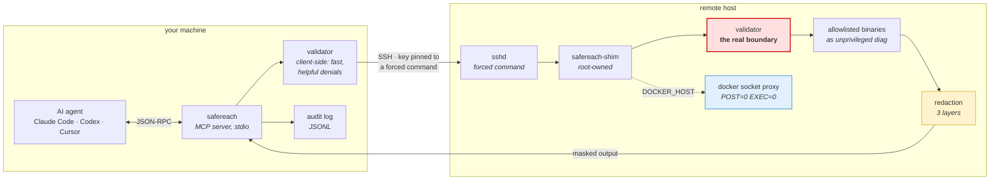
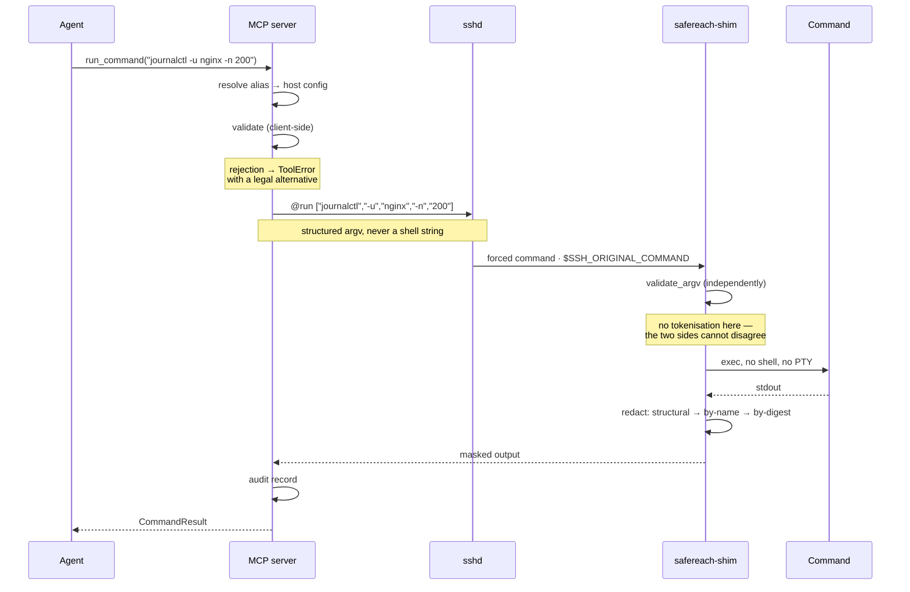
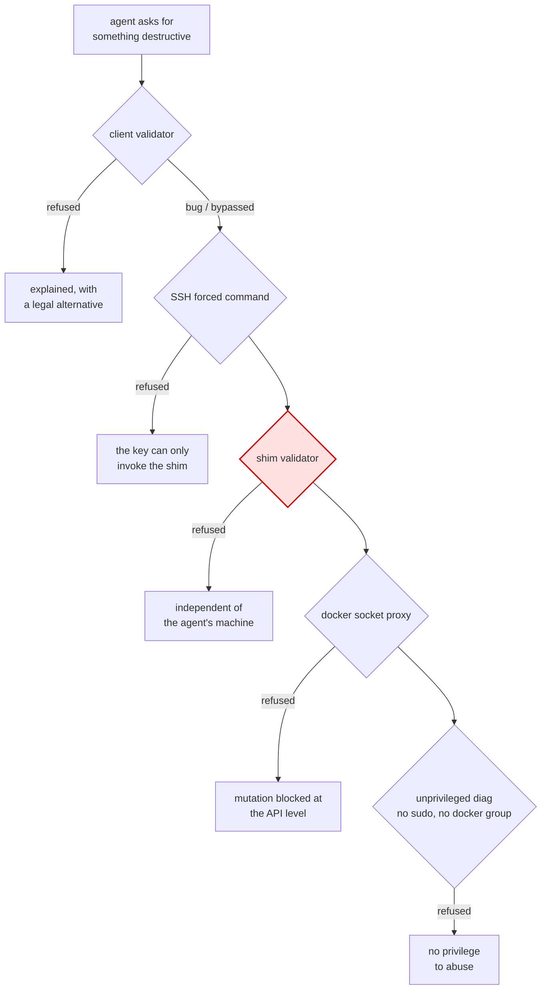
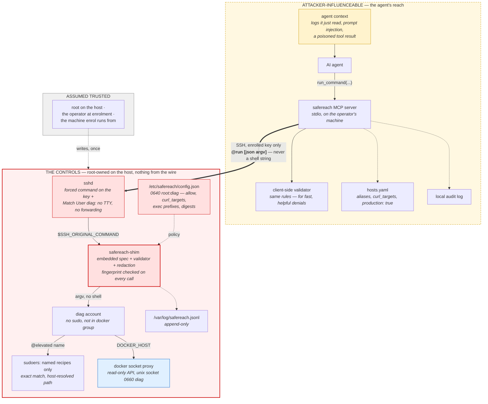
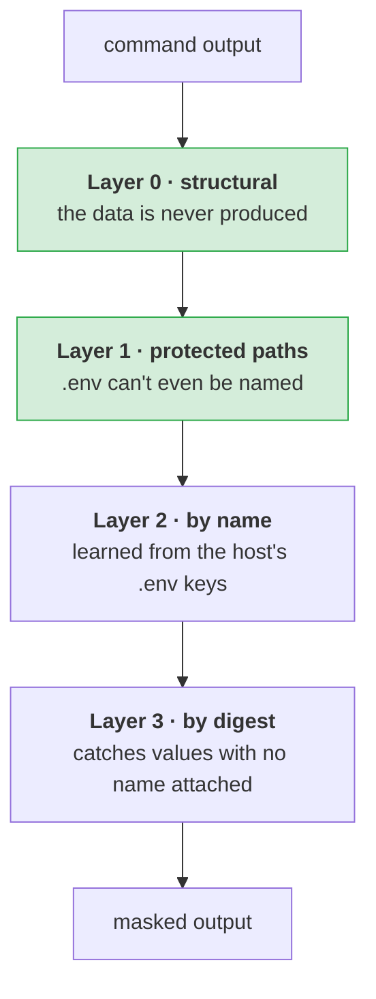

# SafeReach

**Read-only production diagnostics over SSH, as an MCP server.**

Gives an AI agent a competent read-only SRE's eyes on your fleet — journal, service state,
disk, memory, processes, sockets, container logs and `inspect`, HTTP health checks, across
many hosts in parallel — with the hands removed.

The agent can investigate. It cannot change anything, read a secret, escape into a shell,
or reach a host it wasn't granted.

[](https://www.python.org/downloads/)
[](https://modelcontextprotocol.io)
[](https://github.com/Ghost-141/SafeReach/actions/workflows/ci.yml)
[](https://pypi.org/project/safereach/)
[](LICENSE)

---

## Quick start

```bash
uvx safereach@0.3.0 enroll --all      # set up every server you can already ssh to
uvx safereach@0.3.0 install           # register with your agents
```

> **Pre-release:** until this is on PyPI, install from source and register with
> `safereach install --launcher script`. The `uvx` form above is what `install` writes
> once the package is published.

Two commands. **No sudo required, no config file to edit, nothing installed globally.**

If `ssh myserver` works today, the agent can diagnose `myserver`.

---

## Architecture

The validator runs **twice**, on both sides of the SSH connection. That is the central
design decision and the reason this can be pointed at production.



**Why twice.** The MCP server runs on the agent's own machine, so a check that lives there
is one the agent's environment can influence — via a compromised server, a poisoned
context, or a prompt injection arriving in a log line the agent just read. Client-side
validation is a *user-experience* feature: it fails fast and explains why. The shim is the
control that actually holds, because it sits outside everything the agent can reach.

### Request lifecycle



### Defence in depth



**No single failure is catastrophic.** A parser bug lands on the shim. A shim bug lands on
the socket proxy. A proxy bug lands on an account that cannot do much anyway.

---

## Threat model

What this is built to hold against, and what it is not. The picture is the claim: the
agent can influence everything in the amber zone, and none of it is a control. The red
zone is root-owned on the host, reads nothing from the wire, and is what actually decides.



**Assumed hostile:** the agent, and everything in its context. A prompt injection in a log
line the agent just read is the expected attack, not an edge case. Everything the agent can
reach — the MCP server, `hosts.yaml`, the local audit log — is therefore treated as
influenceable. The controls that count live on the host: the shim with its embedded spec,
its root-owned policy file, the forced-command key, sudoers, and the sshd `Match` block.

**Assumed trusted:** root on the managed host, the operator running `enroll`, and the
machine `enroll` runs from at the moment it runs. If any of those is compromised, this
tool is not the boundary.

**Holds, by construction:**

- No state change on a host, in Docker, or in Kubernetes. Every allowlisted binary is
  read-only; the spec linter probes every mutating verb in every position and fails the
  build if one is reachable.
- No shell, no pipes, no subshells, no file writes, no arbitrary path reads, no outbound
  requests except to `host:port` pairs you listed.
- No secret file can be named, in any argument, in any container.
- No command can print another process's argv or environment.
- Docker is reached only through a read-only proxy on a diag-only socket; the agent's
  account is not in the `docker` group and has no sudo beyond named recipes.
- A host running an older allowlist is refused, not served.

**Does not hold, and cannot:**

- **Secrets your application writes to its own logs.** A connection string in a stack
  trace, a token in a request URL. Redaction catches the shapes it knows; the fix is on
  the application side.
- **Names.** Variable names, file names under `/opt`, container names are visible. That
  is deliberate — it is what lets the agent reason about configuration.
- **Client-only mode** (`discover`, or `require_shim: false`). There is no host-side
  control at all. `defaults.production: true` refuses to start with it.

---

## Installation

### Requirements

| Where | Needs |
|---|---|
| Your machine (runs the MCP server) | Python 3.11+, OpenSSH client, `uv` or `pipx`. Linux and macOS tested; Windows via WSL. |
| Each managed host | Any Python 3, OpenSSH server. For `--hardened`: `sudo`, `systemd`, and Docker if you want container diagnostics. Debian/Ubuntu and RHEL-family tested. |
| The agent | Anything that speaks MCP over stdio: Claude Code, Claude Desktop, Codex, Cursor, Windsurf, VS Code, Zed, Gemini CLI. `safereach install` registers with each. |

Nothing is installed on a managed host beyond one stdlib-only Python file and, in hardened
mode, one container.

### Recommended — `uvx`, pinned

```bash
uvx safereach@0.3.0 --help
```

Nothing installed globally, and it is the one launch form that works identically for every
agent. A registration pointing at `/home/you/project/.venv/bin/...` breaks the moment
anything moves; `uvx` does not.

**The version pin is deliberate.** Bare `uvx safereach` refetches from PyPI on every
launch — fine for most tools, wrong for one holding production SSH keys, since it is a
standing supply-chain exposure on the component whose entire job is being a security
boundary. `safereach install` pins automatically; `--unpinned` opts out, and is not
recommended.

### Alternative — a persistent install

```bash
uv tool install safereach==0.3.0
```

### From source

```bash
git clone https://github.com/Ghost-141/SafeReach && cd safereach
uv venv && uv pip install -e ".[dev]"
uv run pytest
```

**Requirements:** Python 3.11+ locally. On managed hosts, **any Python 3** — the shim is a
single stdlib-only file, deliberately, so production hosts need nothing installed.

---

## Setting up hosts

### `enroll` — the default

```bash
safereach enroll myserver          # one host
safereach enroll --all             # everything in ~/.ssh/config
```

Uses the SSH access you already have. **No sudo.** It generates a dedicated keypair, copies
the shim to `~/.local/bin/`, and appends **one** entry to the remote `authorized_keys`:

```
command="/home/you/.local/bin/safereach-shim",no-pty,no-port-forwarding,no-agent-forwarding,no-X11-forwarding,no-user-rc ssh-ed25519 AAAA…
```

Your other entries are untouched, so your own SSH is unaffected — but the agent's key can
invoke nothing except the shim, whatever is sent to it. Same mechanism as
`borg serve --restrict-to-path`, `rrsync` and gitolite.

**The insight:** `command=` is a per-key option in a user-owned file. It needs no root. The
forced command — the actual security boundary — costs nothing to install, so there is no
reason to run without it.

Enrolment then *verifies* the restriction by attempting an escape, and refuses to record
the host if that escape succeeds.

### `enroll --hardened` — for production

```bash
safereach enroll myserver --hardened --elevated dmesg-recent
```

Needs sudo on the target once. Additionally:

- creates an unprivileged `diag` user — **no sudo**, **not in the `docker` group**
- installs the shim to `/usr/local/bin` and its policy to `/etc/safereach`, both
  **root-owned**, so the account cannot rewrite what it is allowed to run. The policy is
  `0640 root:diag`: it holds the HMAC key for the secret digests, and no other local
  account can read it
- starts a **read-only Docker socket proxy** (`POST=0 EXEC=0`), pinned by image digest,
  listening on a **unix socket** (`/run/safereach/docker.sock`, mode `0660`, diag group)
  rather than a TCP port — reachable by `docker` running as `diag` and by nothing else.
  Where the socket bind is not possible it falls back to loopback TCP limited to the
  diag uid by `iptables`, and the shim refuses `curl` to that port however
  `curl_targets` is written
- writes an exact-match sudoers entry for enabled recipes only — never `sudo` itself —
  with the binary path resolved on that host, so `/bin/dmesg` and `/usr/bin/dmesg`
  hosts both match
- adds an sshd `Match User diag` drop-in (`MaxSessions 4`, no forwarding, no TTY),
  validated with `sshd -t` before it is kept and reloaded only if it validates
- makes the audit log **append-only** (`chattr +a`), so the account cannot erase its trail
- offers **only the enrolled key** to the host: the SSH agent is asked for that identity
  and no other, so a personal key that is also authorised there can never win the
  handshake and land in an account without the forced command
- runs every command under `nice -n 19`, `ionice -c 3` and a `prlimit` CPU cap where those
  exist, so a diagnostic loses every scheduling contest with the workload it is diagnosing

For a production fleet, set `defaults.production: true` in `hosts.yaml`. The server then
refuses to start if any host is in client-only mode (`require_shim: false`) or resolves
through `~/.ssh/config`, so the weaker modes are a startup error rather than a warning.

### Production checklist

Before pointing an agent at a host that matters:

- [ ] Enrolled with `--hardened`, never plain `enroll` or `discover`
- [ ] `defaults.production: true` in `hosts.yaml`, so weaker modes cannot creep back in
- [ ] `safereach doctor` shows every host `hardened`, shim fingerprint matching
- [ ] `curl_targets` lists only the `host:port` pairs the agent needs, or is empty
- [ ] `--allow-exec` off, or on with explicit `--exec-container` and `--exec-path`
- [ ] `--elevated` recipes limited to what is needed (`dmesg-recent` is usually enough)
- [ ] `hosts.yaml` and the key under `~/.config/safereach/keys` are mode `0600`
- [ ] Agent registered with `safereach install` (version-pinned `uvx`), not `--unpinned`
- [ ] Host audit log `/var/log/safereach.jsonl` shipped to wherever your other logs go
- [ ] Re-enrolled one non-critical host first after any upgrade that says "re-enrol"

### Naming your hosts

The alias is what the agent types, what `list_hosts` shows, and what every audit record is
keyed on — so enrolment asks:

```
Choose a name for each host (Enter accepts the suggestion):

  deploy@10.0.1.5         [web-01]          > prod-web
  bdren@203.96.189.202    [203.96.189.202]  > langfuse-prod
```

Suggestions come from the `~/.ssh/config` `Host` entry, then the first DNS label
(`db.eu.internal` → `db`), then the raw address. Prompting is TTY-gated, so scripted and
CI enrolment take the suggestion and never block.

```bash
safereach enroll web-01 --name prod-web        # name a single host
safereach enroll --all --names names.yaml      # from a file
safereach enroll --all --no-prompt             # take the suggestions
```

Rename at any time — **local only, no re-enrolment**, because the remote host never knew
the name:

```bash
safereach rename 203.96.189.202 langfuse-prod
safereach rename --interactive
safereach rename --write-names names.yaml      # dump for editing
safereach rename --from names.yaml             # apply
```

A names file may be written either way round; the direction is resolved against the hosts
actually known, falling back to which side parses as an address. When neither settles it
the entry is **refused** rather than guessed — a mapping read backwards points the agent
at the wrong machine.

Every host also carries a stable `id`, derived from `hostname:port` and recorded in each
audit entry alongside the name. Renaming therefore does not sever a host's history —
which matters, because a rename usually happens exactly when something has gone wrong and
you want that history.

### Mode comparison

| | `discover` | `enroll` | `enroll --hardened` |
|---|---|---|---|
| Remote validator behind a forced command | ✗ | ✓ | ✓ |
| Agent's key can get a shell | yes | **no** | **no** |
| Unprivileged dedicated account | ✗ | ✗ | ✓ |
| Docker via read-only proxy | ✗ | ✗ | ✓ |
| Shim rewritable by the account | — | yes | **no** |
| Append-only audit log | ✗ | ✗ | ✓ |
| Needs sudo | no | no | once |

`list_hosts` reports each host's mode, so the agent — and you — can see it.

---

## Secret protection — four layers



**Layer 0 — remove the capability.** A control that deletes a field always beats one that
filters it. `systemctl show` requires `--property` from a safe enum, so `Environment=` is
unrequestable, and `systemctl cat` is denied (it prints the unit file, `Environment=` and
all). `docker inspect` has no `--format` — a Go template reaches `Config.Env` in text form,
past the JSON mask — and `docker history` is denied (`ENV` build layers). `ps` has no
full-format flags and its `-o` columns are an enum with no `args`/`cmd`/`command`, so
`mysql -pSECRET` in a process list cannot be printed. `docker compose config` is denied
(it renders every resolved secret and has no flag to suppress them); `--services` is a
separate permitted path. `kubectl get` loses `-o yaml|json`, where inline `env:` lives,
and `kubectl describe configmap` is denied. `curl` targets are `host:port` — a bare host
means 80 and 443, never every service on loopback — and the host's own Docker API port is
refused before the allowlist is consulted, so the raw API cannot be read around the mask.

**Layer 1 — protected paths.** `*.env`, `*.pem`, `*.key`, `id_rsa*`, `*/.ssh/*`,
`*/.aws/*`, `/etc/shadow`, `/proc/*`, `/sys/*`, `*_history`, this tool's own policy and
binary, and ~40 more, checked against **every argument token** — a path can arrive as a
flag value. The list is **compiled into the shim**: a host policy may add patterns, never
remove them.

**Structural scrubs.** Two outputs carry secrets in a *shape* rather than under a
keyword, so they are rewritten by shape: every process line in a `systemctl status`
CGroup tree is reduced to PID and executable, and every value under an `Environment:`
heading in `kubectl describe` is masked. Neither depends on guessing what a secret looks
like.

**Layer 2 — masking by name.** Enrolment reads the *variable names* from the host's `.env`
files and masks their values in four shapes (`KEY=v`, `KEY: v`, `"KEY": "v"`, `KEY = v`).
Names only — `cut -d= -f1` truncates before any value can escape.

**Layer 3 — masking by digest.** Catches a value appearing with **no variable name** — a
token in a stack trace, a password in a log line. Enrolment computes `HMAC-SHA256` of each
value *as root, on the host*, and stores **only digests**. Gated on length ≥ 12 and entropy
≥ 3.0 bits/char, so `production` and `localhost` stay readable.

All masking happens **on the host, before anything crosses the wire** — so it holds even
against someone using the enrolled key directly.

---

## Non-destructive by construction

The agent cannot delete, remove, stop, restart, prune, kill or scale anything.

That guarantee used to depend on remembering to deny each verb per binary — until
`ip route del default` was found to be **accepted**, because `ip`'s mutating verb sits in
the *positional* slot where subcommand denylists never look.

So it is now enforced by the build:

- `MUTATING_VERBS` (75 verbs) lives in `validator.py` — one source of truth, checked at
  runtime on both sides
- a **spec linter** drives the real validator with every verb against every legal command
  prefix in the spec, and **fails the build** if any is reachable
- every binary must declare whether its positionals are **commands** or **data**, with a
  written justification. Silence is not an option — silence is how `ip` slipped through

---

## Tools the agent sees

| Tool | Purpose |
|---|---|
| `list_hosts` | Aliases, descriptions, security mode. Never hostnames, users or key paths. |
| `select_host` | Pin a server for the session. |
| `describe_commands` | The allowlist in readable form — what may run, and how. |
| `run_command` | Validate → execute → structured result. `host` is optional. |
| `run_on_hosts` | Same, fanned out concurrently. The "who else is broken" tool. |
| `run_in_container` | Read-only commands **inside** a container, for logs not on stdout. |
| `run_elevated` | One named recipe (e.g. `dmesg-recent`). A name, never a command line. |
| `check_connectivity` | Reachability, auth, and the shim version handshake. |

### Choosing a server

`host` is optional. One server configured → used directly. Several → the user is asked via
the client's elicitation UI and the answer is remembered for the session. No elicitation
support → an error naming the options, so the agent asks in conversation. **It never
guesses.**

### Container inspection

`docker logs` covers apps logging to stdout. When a framework writes to a file instead
(`/app/storage/logs/laravel.log`), `run_in_container` runs a read-only command inside:

```
run_in_container("app-1", "tail -n 200 /app/storage/logs/laravel.log")
```

Enable with:

```bash
safereach enroll myserver --hardened --allow-exec \
    --exec-container app-1 --exec-path /app/storage/logs/
```

**Off by default**, and default-deny on both axes: `--allow-exec` requires at least one
`--exec-container` and at least one absolute `--exec-path`. Both are written into the
host's root-owned policy; neither can be supplied over the wire.

What keeps it safe: the inner command is validated by **the same validator**, against a
narrow in-container allowlist (`cat`, `tail`, `head`, `ls`, `stat`, `ps`, `df`, `grep`).
`docker exec app sh -c '…'` fails because `sh` is not allowlisted — not through a special
case. The content-reading commands (`cat`, `tail`, `head`, `grep`) may only name paths
under an `--exec-path` prefix; `ls`, `stat`, `df` and `ps` return names and numbers. The
protected-path list still applies, so `cat /app/.env` and `cat /proc/1/environ` are
refused inside the container too. No TTY, no stdin, no interactive session.

**The tradeoff, stated plainly:** `--allow-exec` requires `POST` on the Docker proxy, which
also permits container create/start at the API level. The command allowlist remains the
control; the proxy no longer is. Leave it off unless you need it.

---

## Testing

```bash
uv run pytest              # the unit and differential suites, about a minute
uv run ruff check .
uv run python shim/build.py
```

| Suite | What it covers |
|---|---|
| `test_validator_attacks` | Adversarial corpus — injection, traversal, escape-hatch binaries |
| `test_spec_lint` | Fails the build if any mutating verb is reachable |
| `test_canary` | Plants a known secret in 12 carriers; asserts it never escapes |
| `test_shim` | Differential — bundled shim must agree with the in-process validator |
| `test_secrets` | Protected paths and name-based masking |
| `test_kubernetes` | Read-only kubectl; secrets denied in every spelling |
| `test_stdio_clean` | stdout carries JSON-RPC and nothing else |
| `test_enroll` | The remote script never clobbers existing `authorized_keys` |
| `test_naming` | Alias validation, stable ids, name-file direction resolution |
| `test_rename` | Rewriting `hosts.yaml` in place without corrupting it |
| `test_exec_inner` | The in-container allowlist: prefixes from host policy, `/proc` denied |
| `test_host_state` | The remote scripts: policy mode, sudoers, sshd drop-in, digest key never on argv |
| `test_ssh_auth` | The SSH agent is pinned to the enrolled key |
| `test_wheel` | The built wheel, in a clean venv, can produce a working shim |
| `e2e/` | All of the above executed on a real host — see below |

The canary suite is the strongest evidence available: per-pattern tests prove the patterns
work, but only a canary suggests nothing escapes. Each case has a **negative control**
asserting the canary *is* present without redaction — otherwise a test that finds nothing
proves only that the input was empty.

---

### End to end, against a real host

Everything above runs in-process. The controls that matter most — the hardened enrolment
as root, the sshd `Match` block, the sudoers file, the proxy's unix socket, the forced
command over a real SSH channel — are exercised for real against a disposable
production-like host: Ubuntu 24.04 with systemd, sshd, sudo, journald and its own Docker
daemon, in a privileged container on your machine.

```bash
SAFEREACH_E2E=1 uv run pytest tests/e2e -v      # needs Docker; a few minutes
python -m tests.e2e.rig up                        # or keep one running to poke at
python -m tests.e2e.rig destroy
```

It enrols the host with `--hardened --allow-exec`, then asserts on the host itself
(policy `0640 root:diag`, socket `0660`, `sshd -T -C user=diag`, `visudo -c`), replays
every reproduction string from the security review through the real shim, checks the
legal diagnostics come back with their secrets scrubbed, and confirms another local
account can read neither the policy nor the socket.

CI runs it on **every push and pull request**, and the `ci-ok` check requires it. The
publish workflow runs it again on the exact tree being released, before the wheel is
built, so nothing reaches PyPI that has not been enrolled onto a real host in the same
run.

## Extending the allowlist

`config/commands.yaml` is data. Adding a binary means enumerating its **safe flags**:

```yaml
mytool:
  description: What it does
  flags:
    "-n": { alias: "--lines", value: { type: int, min: 1, max: 2000 } }
  positionals:
    max: 2
    pattern: '/var/log/[A-Za-z0-9._/\-]{1,200}'
    path_prefixes: ["/var/log/"]
  deny_flags:
    "-o": "writes a file to disk"
```

Check it against these before adding:

- Can it **spawn a child process**? (`-exec`, `--to-command`, `!` escapes) → don't add it
- Can it **write a file**? → deny those flags explicitly
- Can it **read an arbitrary path**? → constrain `path_prefixes`
- Can it **print another process's arguments or environment**? (`ps -f`, `systemctl cat`,
  a `--format` template) → don't add the flag; argv and environments are where passwords live
- Can it **stream forever**? (`-f`, `--follow`) → deny; the timeout is a backstop, not a control
- Can it **read options from a file**? (`curl -K`) → deny; it bypasses the allowlist
- Can it **follow a redirect or reach a port**? → pin `host:port`, deny `-L`

Then run `pytest`. The spec linter will refuse anything mutating, and will require you to
declare whether the binary's positionals are commands or data.

For a privileged read, add an **elevated recipe** rather than widening the parser. Never
put `sudo` in `commands.yaml` — if the agent can pass arguments to `sudo`, the allowlist is
decorative.

---

## Upgrading

Agents are pinned to a version (`uvx safereach@X.Y.Z`), so nothing changes until you say
so. An upgrade is two steps, and the [changelog](CHANGELOG.md) says which apply:

```bash
uvx safereach@X.Y.Z install       # repoint every agent at the new version
safereach shim-update --all       # when the release changed the allowlist or the shim
safereach enroll <host> --hardened  # when the release changed root-owned host state
```

Coming from 0.1.1? Go straight to 0.3.0 and run all three: 0.1.3 and 0.2.0 were never
published on their own. Until `shim-update` runs, a host on the old rules is **refused**,
with a message naming the fingerprints. That is deliberate: a host quietly running an older, looser allowlist is
the failure mode this tool exists to prevent. Enrolment is idempotent, so re-running it
is always safe.

---

## Troubleshooting

`SAFEREACH_SSH_CONFIG=/path/to/ssh_config` makes every `ssh` and `scp` safereach runs use
that file instead of `~/.ssh/config`. OpenSSH resolves `~` from the passwd entry, not
`$HOME`, so this is the only way to point enrolment at a config kept elsewhere.

```bash
safereach doctor          # config, keys, connectivity, shim versions
safereach doctor --fix    # re-push a drifted shim
safereach validate "journalctl -u nginx -n 200" --host myserver
```

| Symptom | Cause |
|---|---|
| `no safereach-shim installed` | Run `safereach enroll <host>` |
| `shim <x> != expected <y>` | Spec changed; `doctor --fix` or `shim-update --all` |
| `SECURITY: the login shell … answered` | The key that connected has no forced command; re-enrol `--hardened` and check `doctor` |
| `is the Docker API on this host` | curl never reaches the proxy; use `docker` |
| `no permitted paths configured` | `--allow-exec` needs `--exec-path` at enrolment |
| `production is true, but:` | A client-only or `~/.ssh/config` host in a production config |
| `Permission denied (publickey)` | Remote `~/.ssh` must be 700, `authorized_keys` 600 |
| `Too many authentication failures` | Add `IdentitiesOnly yes` to `~/.ssh/config` |
| Agent reports a parse error | Something wrote to stdout; check stderr |

---

## Releasing

Publishing is automatic, and triggered by the **version number**, not by merging.

```bash
git switch -c release-0.1.1
sed -i 's/^version = .*/version = "0.1.1"/' pyproject.toml
gh pr create --fill        # merge through review as usual
```

When that PR merges, the publish workflow sees `pyproject.toml` changed, compares the
version against the previous commit, confirms it is not already on PyPI, then runs the
spec linter, the full suite, lint, format check, the end-to-end suite against a real
host, the build, a README render check, and a clean-environment install of the built wheel
that must produce a working shim — and only then uploads. The GitHub release
is tagged afterwards, so a tag always names something that is actually installable.

Merging anything that does not change the version is silently a no-op.

**Why gate on the version rather than publish on every merge:** PyPI versions are
immutable. The first merge that did not bump the version would fail with "file already
exists", and CI would stay red from then on.

Uploads use **Trusted Publishing** (OIDC) with PEP 740 attestations — no API token is
stored anywhere, and each artifact is cryptographically bound to the commit and workflow
that produced it. That matters for a package people install and then point at their own
production servers; the attestation is shown on the PyPI project page.

`Actions → Publish → Run workflow` still allows a manual run, including to TestPyPI.

---

## Contributing

Contributions are welcome, and the bar is written down: [CONTRIBUTING.md](CONTRIBUTING.md)
covers the development setup, the three test layers, how to add a binary to the allowlist
safely, and what a pull request needs. Security issues go through
[SECURITY.md](SECURITY.md), not the issue tracker. Release history is in
[CHANGELOG.md](CHANGELOG.md).

---

## Licence

MIT — see [LICENSE](LICENSE).

---
