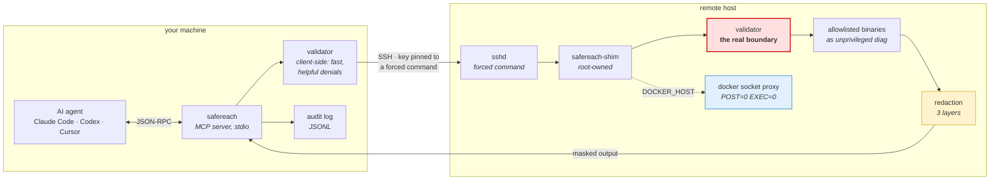
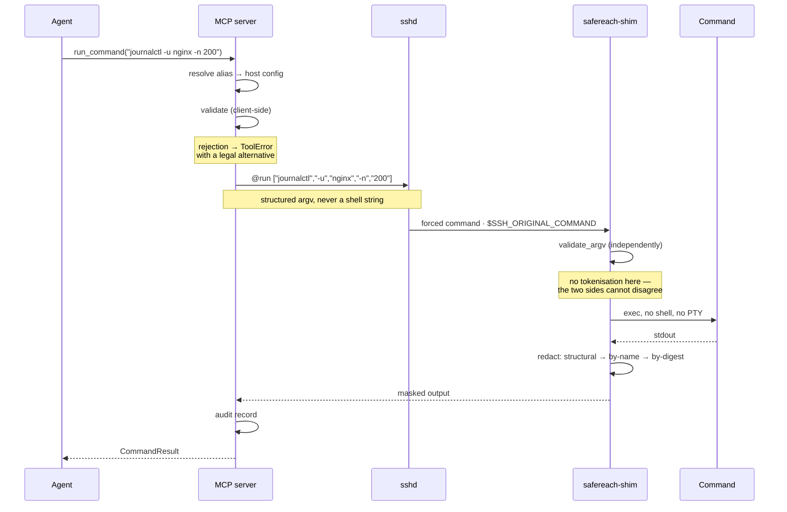
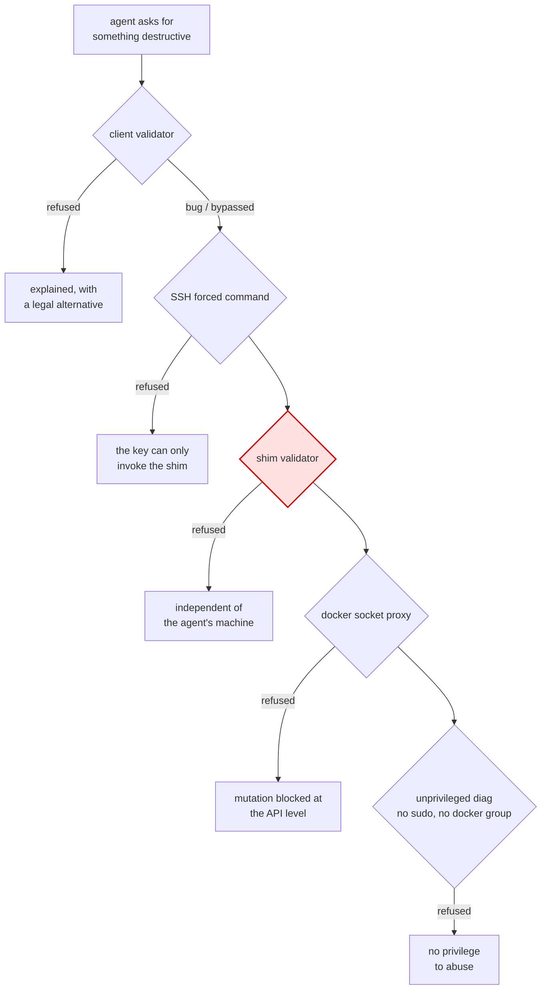
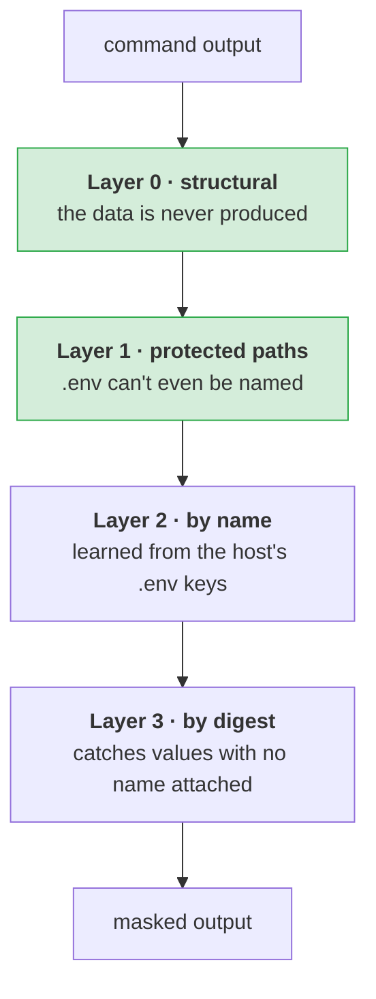

# SafeReach

**Read-only production diagnostics over SSH, as an MCP server.**

Gives an AI agent a competent read-only SRE's eyes on your fleet — journal, service state,
disk, memory, processes, sockets, container logs and `inspect`, HTTP health checks, across
many hosts in parallel — with the hands removed.

The agent can investigate. It cannot change anything, read a secret, escape into a shell,
or reach a host it wasn't granted.

[](https://www.python.org/downloads/)
[](https://modelcontextprotocol.io)
[](#testing)
[](LICENSE)

---

## Quick start

```bash
uvx safereach@0.1.0 enroll --all      # set up every server you can already ssh to
uvx safereach@0.1.0 install           # register with your agents
```

> **Pre-release:** until this is on PyPI, install from source and register with
> `safereach install --launcher script`. The `uvx` form above is what `install` writes
> once the package is published.

Two commands. **No sudo required, no config file to edit, nothing installed globally.**

If `ssh myserver` works today, the agent can diagnose `myserver`.

---

## Architecture

The validator runs **twice**, on both sides of the SSH connection. That is the central
design decision and the reason this can be pointed at production.



**Why twice.** The MCP server runs on the agent's own machine, so a check that lives there
is one the agent's environment can influence — via a compromised server, a poisoned
context, or a prompt injection arriving in a log line the agent just read. Client-side
validation is a *user-experience* feature: it fails fast and explains why. The shim is the
control that actually holds, because it sits outside everything the agent can reach.

### Request lifecycle



### Defence in depth



**No single failure is catastrophic.** A parser bug lands on the shim. A shim bug lands on
the socket proxy. A proxy bug lands on an account that cannot do much anyway.

---

## Installation

### Recommended — `uvx`, pinned

```bash
uvx safereach@0.1.0 --help
```

Nothing installed globally, and it is the one launch form that works identically for every
agent. A registration pointing at `/home/you/project/.venv/bin/...` breaks the moment
anything moves; `uvx` does not.

**The version pin is deliberate.** Bare `uvx safereach` refetches from PyPI on every
launch — fine for most tools, wrong for one holding production SSH keys, since it is a
standing supply-chain exposure on the component whose entire job is being a security
boundary. `safereach install` pins automatically; `--unpinned` opts out, and is not
recommended.

### Alternative — a persistent install

```bash
uv tool install safereach==0.1.0
```

### From source

```bash
git clone https://github.com/Ghost-141/SafeReach && cd safereach
uv venv && uv pip install -e ".[dev]"
uv run pytest
```

**Requirements:** Python 3.11+ locally. On managed hosts, **any Python 3** — the shim is a
single stdlib-only file, deliberately, so production hosts need nothing installed.

---

## Setting up hosts

### `enroll` — the default

```bash
safereach enroll myserver          # one host
safereach enroll --all             # everything in ~/.ssh/config
```

Uses the SSH access you already have. **No sudo.** It generates a dedicated keypair, copies
the shim to `~/.local/bin/`, and appends **one** entry to the remote `authorized_keys`:

```
command="/home/you/.local/bin/safereach-shim",no-pty,no-port-forwarding,no-agent-forwarding,no-X11-forwarding,no-user-rc ssh-ed25519 AAAA…
```

Your other entries are untouched, so your own SSH is unaffected — but the agent's key can
invoke nothing except the shim, whatever is sent to it. Same mechanism as
`borg serve --restrict-to-path`, `rrsync` and gitolite.

**The insight:** `command=` is a per-key option in a user-owned file. It needs no root. The
forced command — the actual security boundary — costs nothing to install, so there is no
reason to run without it.

Enrolment then *verifies* the restriction by attempting an escape, and refuses to record
the host if that escape succeeds.

### `enroll --hardened` — for production

```bash
safereach enroll myserver --hardened --elevated dmesg-recent
```

Needs sudo on the target once. Additionally:

- creates an unprivileged `diag` user — **no sudo**, **not in the `docker` group**
- installs the shim to `/usr/local/bin` and its policy to `/etc/safereach`, both
  **root-owned**, so the account cannot rewrite what it is allowed to run
- starts a **read-only Docker socket proxy** (`POST=0 EXEC=0`), bound to localhost
- writes an exact-match sudoers entry for enabled recipes only — never `sudo` itself
- makes the audit log **append-only** (`chattr +a`), so the account cannot erase its trail

### Mode comparison

| | `discover` | `enroll` | `enroll --hardened` |
|---|---|---|---|
| Remote validator behind a forced command | ✗ | ✓ | ✓ |
| Agent's key can get a shell | yes | **no** | **no** |
| Unprivileged dedicated account | ✗ | ✗ | ✓ |
| Docker via read-only proxy | ✗ | ✗ | ✓ |
| Shim rewritable by the account | — | yes | **no** |
| Append-only audit log | ✗ | ✗ | ✓ |
| Needs sudo | no | no | once |

`list_hosts` reports each host's mode, so the agent — and you — can see it.

---

## Secret protection — four layers



**Layer 0 — remove the capability.** A control that deletes a field always beats one that
filters it. `systemctl show` requires `--property` from a safe enum, so `Environment=` is
unrequestable. `docker compose config` is denied (it renders every resolved secret and has
no flag to suppress them); `--services` is a separate permitted path. `kubectl get` loses
`-o yaml|json`, where inline `env:` lives.

**Layer 1 — protected paths.** `*.env`, `*.pem`, `*.key`, `id_rsa*`, `*/.ssh/*`,
`*/.aws/*`, `/etc/shadow` and ~30 more, checked against **every argument token** — a path
can arrive as a flag value. The list is **compiled into the shim**: a host policy may add
patterns, never remove them.

**Layer 2 — masking by name.** Enrolment reads the *variable names* from the host's `.env`
files and masks their values in four shapes (`KEY=v`, `KEY: v`, `"KEY": "v"`, `KEY = v`).
Names only — `cut -d= -f1` truncates before any value can escape.

**Layer 3 — masking by digest.** Catches a value appearing with **no variable name** — a
token in a stack trace, a password in a log line. Enrolment computes `HMAC-SHA256` of each
value *as root, on the host*, and stores **only digests**. Gated on length ≥ 12 and entropy
≥ 3.0 bits/char, so `production` and `localhost` stay readable.

All masking happens **on the host, before anything crosses the wire** — so it holds even
against someone using the enrolled key directly.

---

## Non-destructive by construction

The agent cannot delete, remove, stop, restart, prune, kill or scale anything.

That guarantee used to depend on remembering to deny each verb per binary — until
`ip route del default` was found to be **accepted**, because `ip`'s mutating verb sits in
the *positional* slot where subcommand denylists never look.

So it is now enforced by the build:

- `MUTATING_VERBS` (75 verbs) lives in `validator.py` — one source of truth, checked at
  runtime on both sides
- a **spec linter** drives the real validator with every verb against every legal command
  prefix in the spec, and **fails the build** if any is reachable
- every binary must declare whether its positionals are **commands** or **data**, with a
  written justification. Silence is not an option — silence is how `ip` slipped through

---

## Tools the agent sees

| Tool | Purpose |
|---|---|
| `list_hosts` | Aliases, descriptions, security mode. Never hostnames, users or key paths. |
| `select_host` | Pin a server for the session. |
| `describe_commands` | The allowlist in readable form — what may run, and how. |
| `run_command` | Validate → execute → structured result. `host` is optional. |
| `run_on_hosts` | Same, fanned out concurrently. The "who else is broken" tool. |
| `run_in_container` | Read-only commands **inside** a container, for logs not on stdout. |
| `run_elevated` | One named recipe (e.g. `dmesg-recent`). A name, never a command line. |
| `check_connectivity` | Reachability, auth, and the shim version handshake. |

### Choosing a server

`host` is optional. One server configured → used directly. Several → the user is asked via
the client's elicitation UI and the answer is remembered for the session. No elicitation
support → an error naming the options, so the agent asks in conversation. **It never
guesses.**

### Container inspection

`docker logs` covers apps logging to stdout. When a framework writes to a file instead
(`/app/storage/logs/laravel.log`), `run_in_container` runs a read-only command inside:

```
run_in_container("app-1", "tail -n 200 /app/storage/logs/laravel.log")
```

Enable with `enroll --hardened --allow-exec --exec-container app-1`. **Off by default.**

What keeps it safe: the inner command is validated by **the same validator**, against a
narrow in-container allowlist (`cat`, `tail`, `head`, `ls`, `stat`, `ps`, `df`, `grep`).
`docker exec app sh -c '…'` fails because `sh` is not allowlisted — not through a special
case. `deny_paths` still applies, so `cat /app/.env` is refused inside the container too.
No TTY, no stdin, no interactive session.

**The tradeoff, stated plainly:** `--allow-exec` requires `POST` on the Docker proxy, which
also permits container create/start at the API level. The command allowlist remains the
control; the proxy no longer is. Leave it off unless you need it.

---

## Testing

```bash
uv run pytest              # 756 tests
uv run ruff check .
uv run python shim/build.py
```

| Suite | What it covers |
|---|---|
| `test_validator_attacks` | Adversarial corpus — injection, traversal, escape-hatch binaries |
| `test_spec_lint` | Fails the build if any mutating verb is reachable |
| `test_canary` | Plants a known secret in 12 carriers; asserts it never escapes |
| `test_shim` | Differential — bundled shim must agree with the in-process validator |
| `test_secrets` | Protected paths and name-based masking |
| `test_kubernetes` | Read-only kubectl; secrets denied in every spelling |
| `test_stdio_clean` | stdout carries JSON-RPC and nothing else |
| `test_enroll` | The remote script never clobbers existing `authorized_keys` |

The canary suite is the strongest evidence available: per-pattern tests prove the patterns
work, but only a canary suggests nothing escapes. Each case has a **negative control**
asserting the canary *is* present without redaction — otherwise a test that finds nothing
proves only that the input was empty.

---

## Release notes

### 0.1.0 — initial release

**Core**
- MCP server (SDK v2, stdio) exposing eight read-only diagnostic tools
- Two-sided validation: client-side for error quality, remote shim as the real boundary
- Structured argv over the wire — no tokenisation on the remote side, so the two
  validators cannot disagree about quoting
- Connection pooling, per-command timeouts, output caps, concurrent fan-out

**Security**
- SSH forced command; enrolment verifies the restriction and refuses the host if an escape
  succeeds
- Hardened mode: unprivileged account, root-owned shim and policy, read-only Docker proxy,
  exact-match sudoers, append-only audit log
- Four-layer secret protection (structural · paths · names · digests), applied on the host
- Spec linter enforcing non-destructiveness at build time
- Shim fingerprinting: a drifted host is refused, not warned about

**Allowlist** — `journalctl`, `systemctl`, `dmesg`, `df`, `du`, `free`, `uptime`, `nproc`,
`hostnamectl`, `ps`, `ss`, `ip`, `tail`, `head`, `grep`, `stat`, `ls`, `docker`, `curl`,
`kubectl`

**Known limits**
- Masking is best-effort for unstructured text; Layers 0–1 are structural, 2–3 are not
- The `diag` account is in `adm`, so it can read `/var/log` — inherent to being useful
- Kubernetes RBAC is not automated; the allowlist is not a substitute for a read-only Role
- ~900 lines of security-critical code with no external audit yet

---

## Extending the allowlist

`config/commands.yaml` is data. Adding a binary means enumerating its **safe flags**:

```yaml
mytool:
  description: What it does
  flags:
    "-n": { alias: "--lines", value: { type: int, min: 1, max: 2000 } }
  positionals:
    max: 2
    pattern: '/var/log/[A-Za-z0-9._/\-]{1,200}'
    path_prefixes: ["/var/log/"]
  deny_flags:
    "-o": "writes a file to disk"
```

Check it against these before adding:

- Can it **spawn a child process**? (`-exec`, `--to-command`, `!` escapes) → don't add it
- Can it **write a file**? → deny those flags explicitly
- Can it **read an arbitrary path**? → constrain `path_prefixes`
- Can it **stream forever**? (`-f`, `--follow`) → deny; the timeout is a backstop, not a control
- Can it **read options from a file**? (`curl -K`) → deny; it bypasses the allowlist

Then run `pytest`. The spec linter will refuse anything mutating, and will require you to
declare whether the binary's positionals are commands or data.

For a privileged read, add an **elevated recipe** rather than widening the parser. Never
put `sudo` in `commands.yaml` — if the agent can pass arguments to `sudo`, the allowlist is
decorative.

---

## Troubleshooting

```bash
safereach doctor          # config, keys, connectivity, shim versions
safereach doctor --fix    # re-push a drifted shim
safereach validate "journalctl -u nginx -n 200" --host myserver
```

| Symptom | Cause |
|---|---|
| `no safereach-shim installed` | Run `safereach enroll <host>` |
| `shim <x> != expected <y>` | Spec changed; `doctor --fix` |
| `Permission denied (publickey)` | Remote `~/.ssh` must be 700, `authorized_keys` 600 |
| `Too many authentication failures` | Add `IdentitiesOnly yes` to `~/.ssh/config` |
| Agent reports a parse error | Something wrote to stdout; check stderr |

---

## Licence

MIT — see [LICENSE](LICENSE).
